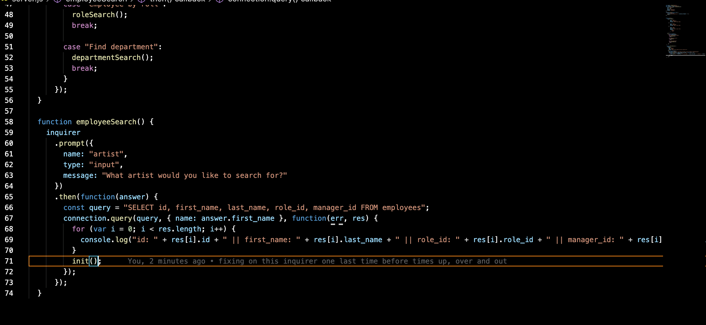
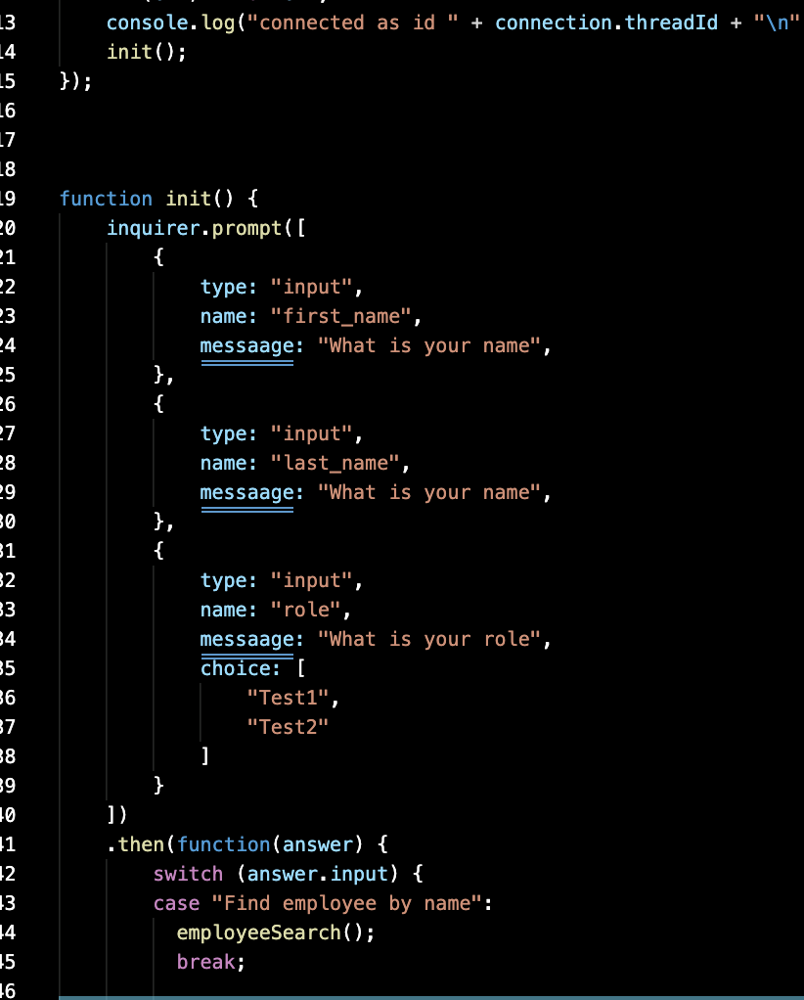
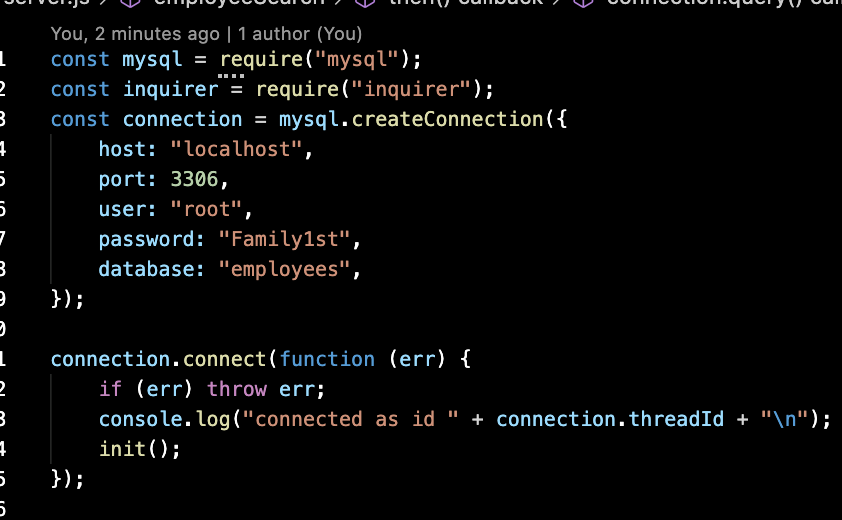

# our-employee-tracker

Building a command-line application that at a minimum allows the user to:

  * Add departments, roles, employees

  * View departments, roles, employees

  * Update employee roles

  * Use [console.table](https://www.npmjs.com/package/console.table) to print MySQL rows to the console. There is a built-in version of `console.table`, but the NPM package formats the data a little better for our purposes.

* You may wish to have a separate file containing functions for performing specific SQL queries you'll need to use. Could a constructor function or a class be helpful for organizing these?

* You will need to perform a variety of SQL JOINS to complete this assignment, and it's recommended you review the week's activities if you need a refresher on this.

  

* Check out [SQL Bolt](https://sqlbolt.com/) for some extra MySQL help.

  

# The Bad
    
# The Light Bulb
   
# The Good
    

This homework was great but i had a few challenges like always.i can inquirer great but i need work with my get... i wished i tried another way like express.... Thanks for reading and i will be updating this for my knowing purpose. 

<iframe src="https://drive.google.com/file/d/1yUqKXtoal_bzzbozZh80NVrEWIMaO-hC/preview" width="640" height="480"></iframe>